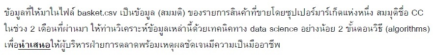

# Goods Recommendation

The information contained in the basket data set is fictitious details obtained from a supermarket. There are 1361 lists in all. The overall data is encoded in a one-hot format. The goal of the work is to promote a product that should be offered together. ```Apriori algorithm``` and ```FP growth algorithm``` are two methods that I implement. First step is format convertion. Next, set the confidence value to 0.6 and the support value to 0.025. Finally, display the top five items that should be marketed jointly.



👉 [jupyter notebook](https://github.com/tan-koo/Goods-Suggestion/blob/master/jupyter/goods.ipynb) This is how I work the ```programming```